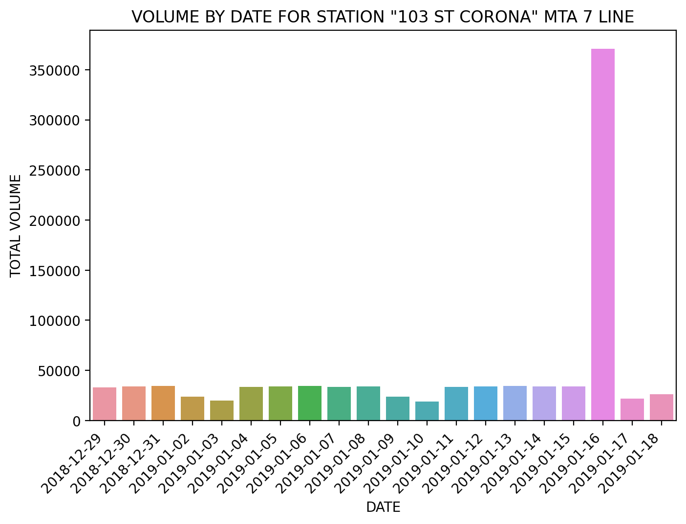

## IMPORT DATA

1. Download files from web
2. Convert to CSV
3. Use csv-to-sqlite in commandline to import csvs as tables
4. Name the DB (mta_turbstile.db)
5. Use sqlalchemy to create engine and bring in all tables
6. Bring in a slice of 3 tables (approx 3 weeks of data)
    - *LATER: WILL BRING IN 50 TABLES*
7. Concat tables using a for loop

## CLEAN DATA

### FORMATTING
1. Remove insane amount of space after 'EXITS' column
2. Offset the time by 1 hour for all times occuring from midnight to midnight:59 so data would be included for the previous day
    - ex: '00:30:00' will be '23:30:00' on the previous day
    
### CALCULATING NET ENTRIES/EXITS PER TURNSTILE
3. Get cumulative number for ENTRIES and EXITS **per TURNSTILE, per DATE**
    - grouped by TURNSTILE/STATION/DATE/LINENAME (to keep this column)
    - last entry of the day should have the highest cumulative number, but some turnstiles are counting backwards, I grabbed the .max()
4. For each TURNSTILE at each STATION, create 3 new columns
    - PREV_DATE: date of previous day
    - PREV_ENTRIES: cumulative entries of previous day
    - PREV_EXITS: cumulative exits of previous day
5. Drop the row for the first DATE for each TURNSTILE/STATION group

### DEAL WITH WEIRD VALUES
6. Per TURNSTILE, NET = CURRENT - PREVIOUS
    - People Per Minute Through Turnstile: What is a realistic #? Currently: 30 people per minute aka a person every other second
7. IF NET is negative, take absolute value
    - turnstile might have been counting backwards
8. If NET is greater than 30 people per minute through the turnstile use the smaller value
    - maybe the turnstile reset back to 0 
9. If the NET is still greater than 30 people per minute return 0
    - maybe turnstile is broken 
    
### CALCULATING NET ENTRIES/EXITS PER STATION
10. Sum all entries for each TURNSTILE for each **STATION per DATE** per LINENAME (to keep this column)
11. Create column NET_BUSY for total volumn per STATION per DATE

## LIMIT DATA
12. Only want to use ONE subway LINE to limit amount of stops
13. Find the amount of stops per LINE to pick shortest LINE
14. LINE strings need a delimiter to separate for getting dummies
    - seplace empty string with ','
    - strip the ',' at beginning and end of each string
    - create dummies using ',' as delimiter
    - glue dummy DF onto main DF, drop old columns
15. Count the number of stations per line
    - per line, grouped by line and counted unique stations with a value of 1
    - *LATER: DOESN'T SEEM ACCURATE - need to investigate
    - ex: the 7 line should have 22 local -- I am getting back 25 stations
16. Limit to 7 LINE not including Manhattan Stations
    - 21 Unique Stations
    
    
## VISUALIZATIONS
17. Pick one station to show a visualization
    - 103 ST-CORONA
18. Plot total volume by date (reminder; only 3 weeks of data)

## GOAL
19. Select 3-5 stations on the 7 line
20. Show ridership patterns for an entire year
21. Any particular months where ridership is low?
22. Any particular day of week?
23. Use patterns to inform which days the MTA can shut down that station to perform maintenance
    - assuming maintenance is an entire day operation