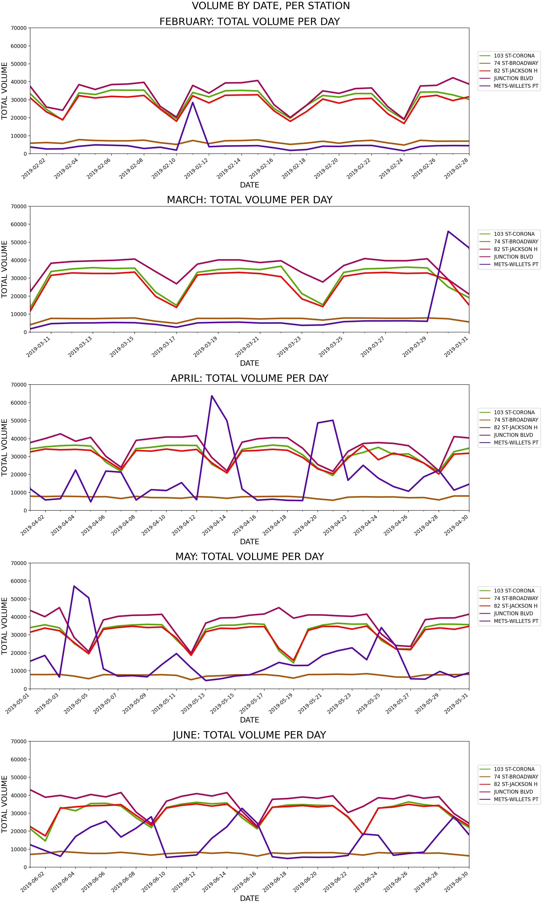
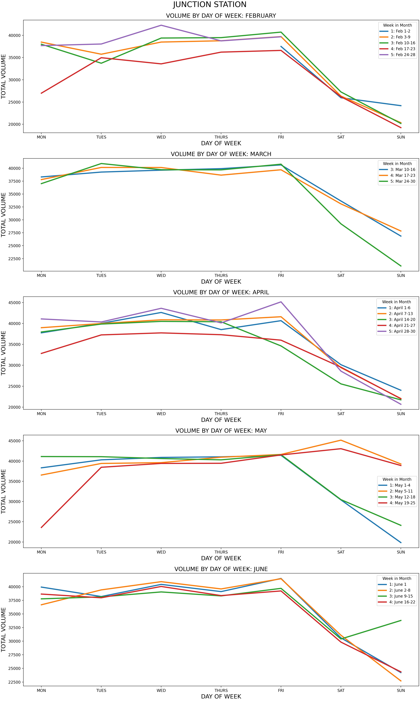
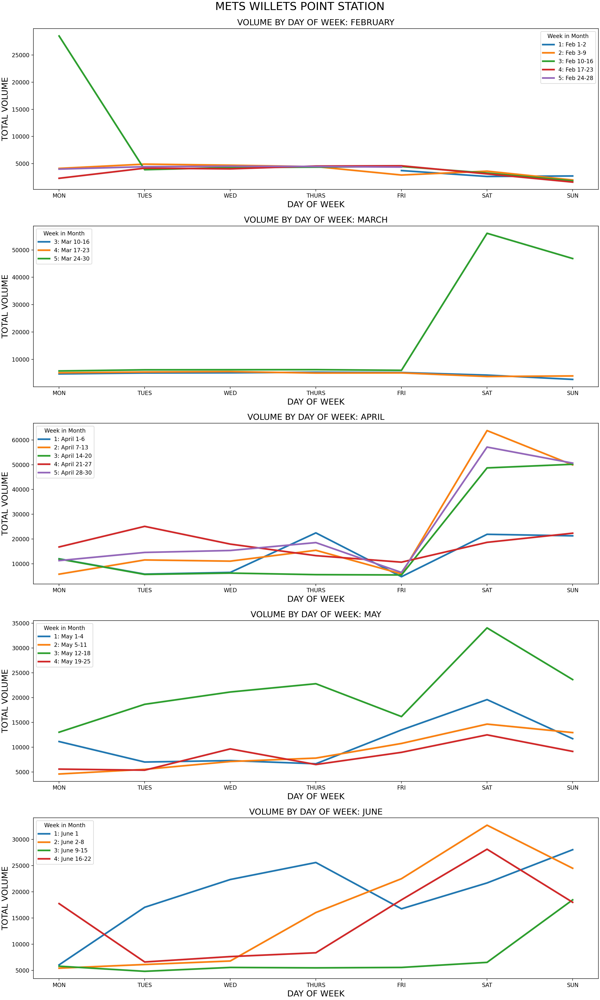

# **MTA REPAIRS AND RENOVATIONS**
Leslie Cardone  
April 1, 2021  
Metis: Exploratory Data Analysis

## ABSTRACT

The goal of this project is to use turnstile data, provided by the MTA, to view and understand trends in ridership across several stations on the 7 Line in Queens. The data was organized and cleaned with the Python data analysis library, pandas. All visualizations were created with Matplotlib and Seaborn.

## DESIGN

The New York subway system is an important mode of transportation for city inhabitants. According to the [MTA website](https://new.mta.info/agency/new-york-city-transit/subway-bus-ridership-2019), annual subway ridership has been hovering consistently around 1.7 billion since 2014. Recently in 2019, the MTA logged a total of 1.698 billion subway riders.

The MTA relies on 'fairbox revenue' from these riders to pay employees' salaries, purchase maintenance equipment, and keep operations running. 

The most cost efficient practice for the MTA would be to disrupt ridership as little as possible and shut down stations for repairs during natural dips throughout the year. 

## DATA

Like the MTA subway system, the [MTA turnstile data](http://web.mta.info/developers/turnstile.html) is expansive and a bit unruly.

The dataset contains [fields](http://web.mta.info/developers/resources/nyct/turnstile/ts_Field_Description.txt) for 'Control Area','Remote Unit', and 'Subunit Channel Position.' Multiple sources across the web have suggested that combining these three fields creates the 'ID' for an individual turnstile.

'Entries' and 'Exits' are cumulative values that will increase to a number up to 10 digits long before resetting back to zero. Some of these values have been impacted by hardware failure or data corruption.

Because we are only looking into five specific stations for this analysis, we do not need to consider specific situations with transfer stations and 'station complexes.' The stations used in the analysis were taken at face value based on the 'Station' field.

## ALGORITHMS/TOOLS

*LIBRARIES*
- SQLalchemy
- Numpy and Pandas for data manipulation
- Matplotlib and Seaborn for plotting
- datetime to handle dates

*IMPORT DATA*

1. Download files from web
2. Convert to CSV
3. Use csv-to-sqlite in commandline to import csvs as tables
4. Name the database (mta_turbstile.db)
5. Use sqlalchemy to create engine and bring in all tables
6. Bring in a slice of 22 tables (approx 5 months of data)
7. Concat tables using a for loop

*FORMATTING & CLEANING*

8. Isolate the time period February 2019 through June 2019.
9. Isolate all stations for the 7 line
10. Remove spacing inconsistencies in columns
11. Offset the time by 1 hour for all times occurring from midnight to midnight:59 so data would be included for the previous day
    - ex: '00:30:00' will be '23:30:00' on the previous day
    
*CALCULATING NET ENTRIES/EXITS PER TURNSTILE*

12. Get cumulative number for ENTRIES and EXITS **per TURNSTILE, per DATE**
    - grouped by TURNSTILE/STATION/DATE/LINENAME
    - last entry of the day should have the highest cumulative number, but some turnstiles are counting backwards so we used the .max() value for the day
13. For each TURNSTILE at each STATION, create 3 new columns
    - PREV_DATE: date of previous day
    - PREV_ENTRIES: cumulative entries of previous day
    - PREV_EXITS: cumulative exits of previous day
14. Drop the row for the first DATE for each TURNSTILE/STATION group

*DEAL WITH WEIRD VALUES*

15. Per TURNSTILE, NET = CURRENT - PREVIOUS
    - People Per Minute Through Turnstile: Used 30 people per minute per 24 hour period aka a person every other second
16. IF NET is negative, take absolute value
    - turnstile might have been counting backwards
17. If NET is greater than 30 people per minute through the turnstile use the smaller value
    - maybe the turnstile reset back to 0 
18. If the NET is still greater than 30 people per minute return 0
    - maybe turnstile is broken
    - **would have been ideal to use the mean of the surrounding turnstiles instead of 0**
    
*CALCULATING NET ENTRIES/EXITS PER STATION*

19. Sum all entries for each TURNSTILE for each **STATION per DATE** 
20. Create column NET_BUSY for total volume per STATION per DATE

*LIMITING DATA*

21. Create a dataframe with the five stations we are looking at
22. Create individual dataframes for each of the five stations

## COMMUNICATION
*VISUALIZATIONS*
1. FEB-JUNE, TOTAL VOLUME PER DAY PER STATION

2. FEB-JUNE, VOLUME FOR DAY OF WEEK FOR JUNCTION STATION

3. FEB-JUNE, VOLUME FOR DAY OF WEEK FOR METS-WILLETS POINT STATION

